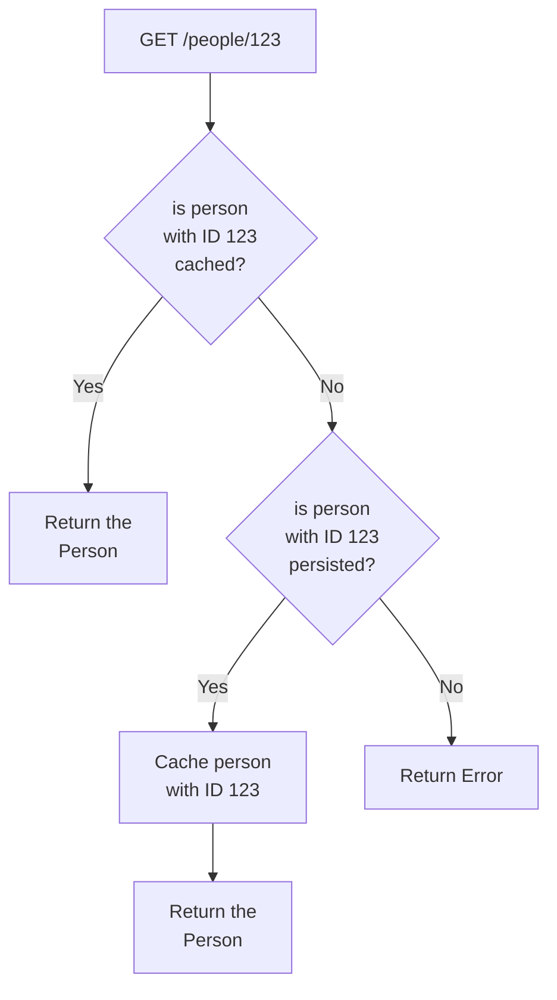

# POC: Redis Cache Aside Strategy

It demonstrates how to implement caching based on cache aside (write on miss) strategy using Redis.

We want to implement a Web Service that allows us to create a person and find it by the random ID generated to the
person after persisting it on a Postgres relational database. The goal is to cache the person after we try to find them
by ID for the first time, so next requests to find that person takes less time to respond.

To avoid writing abstractions and boilerplate code, we are going to depend on Spring MVC for the Web layer, Spring Data
JPA for persistence on relational database and Spring Data Redis for caching. The source code should be evaluated using
automated tests with database containers provisioned by TestContainers and tests managed by JUnit.

## How to run

| Description | Command          |
|:------------|:-----------------|
| Run tests   | `./gradlew test` |

## Preview

Cache Aside Strategy execution flow:



Logging output after creating a person:

```text
2022-07-08T22:32:38.980-03:00  INFO 50734 --- [o-auto-1-exec-1] o.a.c.c.C.[Tomcat].[localhost].[/]       : Initializing Spring DispatcherServlet 'dispatcherServlet'
2022-07-08T22:32:38.980-03:00  INFO 50734 --- [o-auto-1-exec-1] o.s.web.servlet.DispatcherServlet        : Initializing Servlet 'dispatcherServlet'
2022-07-08T22:32:38.981-03:00  INFO 50734 --- [o-auto-1-exec-1] o.s.web.servlet.DispatcherServlet        : Completed initialization in 0 ms
2022-07-08T22:32:39.072-03:00  INFO 50734 --- [o-auto-1-exec-1] com.example.person.PersonServiceDefault  : Person saved (person=Person(id=432d0066-8be3-4576-8737-b3c42f02ebad, name=John Smith, age=45))
```

Logging output after finding the person by ID multiple times:

```text
2022-07-08T22:32:39.251-03:00  INFO 50734 --- [o-auto-1-exec-2] com.example.person.PersonServiceDefault  : Person retrieved from database (personId=432d0066-8be3-4576-8737-b3c42f02ebad)
2022-07-08T22:32:39.255-03:00  INFO 50734 --- [o-auto-1-exec-2] com.example.person.PersonServiceDefault  : Person cached (key=432d0066-8be3-4576-8737-b3c42f02ebad, value=Person(id=432d0066-8be3-4576-8737-b3c42f02ebad, name=John Smith, age=45)
2022-07-08T22:32:39.273-03:00  INFO 50734 --- [o-auto-1-exec-3] com.example.person.PersonServiceDefault  : Person retrieved from cache (personId=432d0066-8be3-4576-8737-b3c42f02ebad)
2022-07-08T22:32:39.281-03:00  INFO 50734 --- [o-auto-1-exec-4] com.example.person.PersonServiceDefault  : Person retrieved from cache (personId=432d0066-8be3-4576-8737-b3c42f02ebad)
2022-07-08T22:32:39.289-03:00  INFO 50734 --- [o-auto-1-exec-5] com.example.person.PersonServiceDefault  : Person retrieved from cache (personId=432d0066-8be3-4576-8737-b3c42f02ebad)
```
